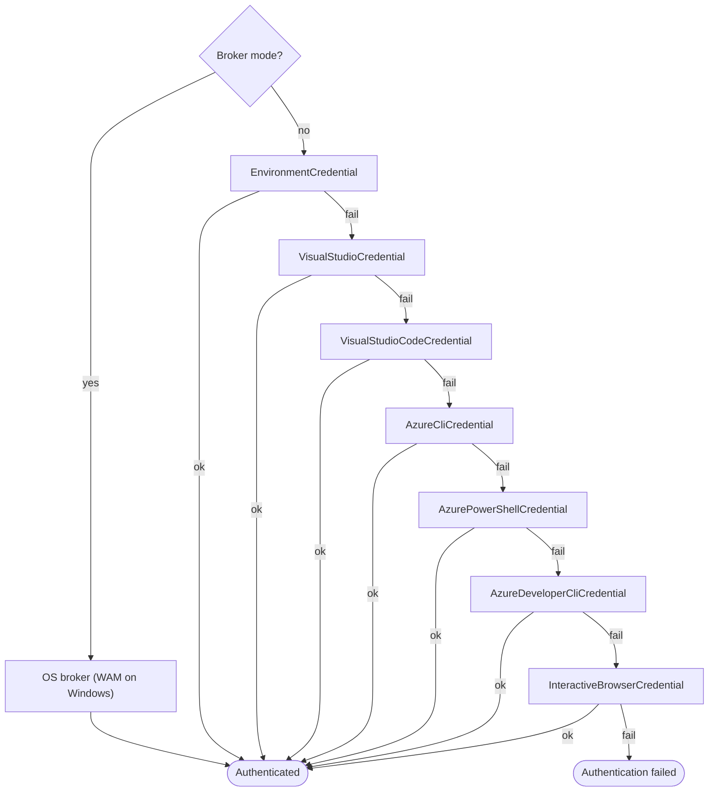
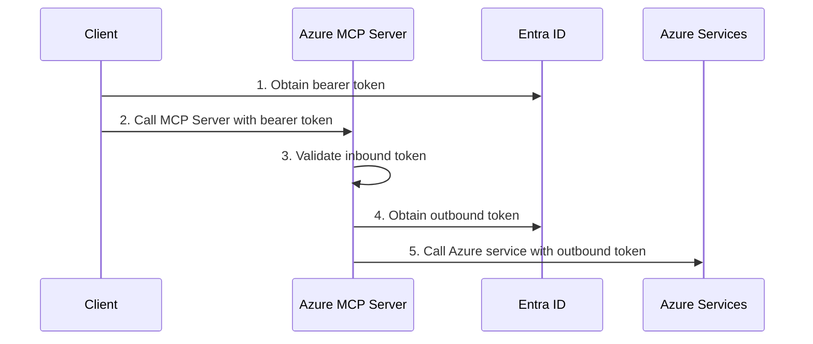

# Authentication in Azure MCP Server

> [!NOTE]
> At present, this file is written with focus on the [Azure MCP server](../servers/Azure.Mcp.Server/README.md). However, many details apply to other MCP servers in this repo because the most of the underlying authentication and authorization code is in the shared [`Microsoft.Mcp.Core`](../core/Microsoft.Mcp.Core/) library.

Azure MCP Server runs in two transport modes — **stdio** (local) and **HTTP** (remote) — each with a different authentication model.

| | Stdio (local) | HTTP (remote) |
|---|---|---|
| **Who authenticates to Azure?** | The server itself, using your developer credentials | Depends on the outgoing auth strategy (see below) |
| **Inbound auth required?** | No — communication is over local process pipes | Yes — Entra ID bearer tokens protect every request |
| **Typical use** | IDE extensions, CLI, local agents | Cloud-hosted server shared by multiple clients/agents |

## Local Authentication (Stdio Transport)

When the server runs locally (the default), it authenticates directly to Azure services using credentials available on your machine.

### How credentials are resolved

The server uses a chain of credential providers. The first one that succeeds is used:



> [!NOTE]
> You can skip the chain and pin a specific credential by setting the `AZURE_TOKEN_CREDENTIALS` environment variable to the credential name. For example, to use only Azure CLI: `AZURE_TOKEN_CREDENTIALS=AzureCliCredential`.

> [!TIP]
> In VS Code, run **Azure: Sign In** from the Command Palette (ctrl+shift+p) to authenticate quickly.

### Broker mode

Set `AZURE_MCP_ONLY_USE_BROKER_CREDENTIAL=true` to skip the chain entirely and use the OS authentication broker (Web Account Manager on Windows). On unsupported operating systems it falls back to browser-based login.

### RBAC

Regardless of which credential is used, the authenticated identity must have the appropriate Azure RBAC roles on the target resources (for example, **Storage Blob Data Reader** for storage operations). See [What is Azure RBAC?](https://learn.microsoft.com/azure/role-based-access-control/overview) for details. For **User-Assigned Managed Identity**, also set `AZURE_CLIENT_ID` to the managed identity's client ID. If unset, System-Assigned Managed Identity is used.

### Choosing credentials by environment

| Environment | Recommended setup |
|---|---|
| **Local development** | Sign in with `az login`, VS Code Azure extension, or Azure PowerShell. The chain picks it up automatically. |
| **CI / CD pipelines** | Set `AZURE_CLIENT_ID`, `AZURE_CLIENT_SECRET`, and `AZURE_TENANT_ID` environment variables (service principal). |
| **Production (hosted)** | HTTP transport is recommended for production hosting — see Remote [Authentication (HTTP Transport)](#remote-authentication-http-transport). If STDIO is required, set AZURE_TOKEN_CREDENTIALS=prod to restrict the chain to Environment, Workload Identity, and Managed Identity credentials only — no interactive browser fallback. |

---

## Remote Authentication (HTTP Transport)

When the Azure MCP Server is hosted remotely (for example, on Azure Container Apps) using HTTP transport, authentication operates in two layers:

1. **Inbound authentication** — the client authenticates to the Azure MCP Server
2. **Outbound authentication** — the Azure MCP Server authenticates to downstream Azure services



> [!TIP]
> Want to get started quickly? The [`azd` templates](#deploy-with-azd-templates) below automate the entire setup illustrated above.

### Inbound Authentication

Every incoming request must carry a valid Entra ID bearer token in the `Authorization` header. The Azure MCP Server supports two access scenarios, each requiring a specific claim in the inbound token:

| Access Scenario | Description | Required Claim |
|---|---|---|
| [**Delegated access**](https://learn.microsoft.com/entra/identity-platform/delegated-access-primer) | The token represents both an application and a signed-in user | `Mcp.Tools.ReadWrite` scope |
| [**App-only access**](https://learn.microsoft.com/entra/identity-platform/app-only-access-primer) | The token represents only the application — no user is involved | `Mcp.Tools.ReadWrite.All` role |

> [!NOTE]
> The Azure MCP Server validates the inbound token and the required claim but does not control how the token is obtained. For more information about access scenarios and permissions, see [Permissions and consent in the Microsoft identity platform](https://learn.microsoft.com/entra/identity-platform/permissions-consent-overview).

### Outbound Authentication

The `--outgoing-auth-strategy` flag (`UseOnBehalfOf` or `UseHostingEnvironmentIdentity`) is passed when starting the Azure MCP Server and controls how it obtains outbound tokens to access downstream Azure services:

| Outbound Authentication | Behavior |
|---|---|
| **On-Behalf-Of** (`UseOnBehalfOf`) | Azure MCP Server exchanges the inbound user bearer token for a new token to access the downstream service |
| **Hosting Environment Identity** (`UseHostingEnvironmentIdentity`) | Azure MCP Server uses the hosting environment identity (typically a Managed Identity) to obtain a token to access the downstream service |

> [!NOTE]
> If `--outgoing-auth-strategy` is not specified, the server defaults to `UseOnBehalfOf`.

### Supported Authentication Combinations

Use the following to verify your chosen inbound and outbound combination is supported:

| Inbound Authentication | Outbound Authentication | Supported |
|---|---|---|
| Delegated | On-Behalf-Of | ✅ |
| Delegated | Hosting Environment Identity | ✅ |
| Application | Hosting Environment Identity | ✅ |
| Application | On-Behalf-Of | ❌ Application bearer token carries no user identity, so there is nothing to exchange in an On-Behalf-Of flow |

### Choosing an Outbound Authentication Strategy

The right strategy depends on your security, auditing, and deployment requirements. **On-behalf-of is strongly encouraged** because the strategy retains the user's level of access for interacting with Azure resources.

| | On-Behalf-Of | Hosting Environment Identity |
|---|---|---|
| **Per-user RBAC** | Yes | No — shared identity |
| **Audit trail** | Per-user | Server identity only |
| **Inbound auth type** | Delegated only | Delegated or Application |
| **Best for** | Multi-tenant / enterprise / compliance-sensitive scenarios | Single-team or single-client-application scenarios |
|**Risks**|None.|User invoking MCP server is "elevated" to the server's level of access.|

### Deploy with azd Templates

Configuring Entra ID app registrations, scopes, roles, and hosting infrastructure manually is complex. The following Azure Developer CLI (`azd`) templates automate the entire setup including deploying Azure MCP Server to Azure Container Apps:

| Template | Outbound Strategy | Client (Agent) |
|---|---|---|
| [**azmcp-obo-template**](https://github.com/Azure-Samples/azmcp-obo-template) | On-Behalf-Of | Foundry Agent, Copilot Studio, C# Client |
| [**azmcp-foundry-aca-mi**](https://github.com/Azure-Samples/azmcp-copilot-studio-aca-mi) | Hosting Environment Identity | Foundry Agent |
| [**azmcp-copilot-studio-aca-mi**](https://github.com/Azure-Samples/azmcp-copilot-studio-aca-mi) | Hosting Environment Identity | Copilot Studio |

Each `azd` template provisions:

- Entra ID app registration(s) with the correct scopes and roles
- Managed identity with appropriate RBAC assignments
- Azure Container App configured to run the Azure MCP Server with all required environment variables and server flags

### Implementation Details

Users of the Azure MCP server are encouraged to begin with using the provided [`azd` templates](#deploy-with-azd-templates) for deployment. This section is intended for:
1. Maintainers of this repo who want to understand how the Azure MCP Server implements the authentication flows described above
1. Users of the Azure MCP server that cannot use the provided [`azd` templates](#deploy-with-azd-templates) and need to craft an equivalent set of configuration through other means.

#### AzureAd Configuration

The server reads its Entra ID configuration from the `AzureAd` section. The key properties are:

| Property | Description |
|---|---|
| `Instance` | The Entra ID authority URL (e.g., `https://login.microsoftonline.com/` for the public cloud) |
| `TenantId` | The directory (tenant) ID of the Entra ID tenant |
| `ClientId` | The application (client) ID of the server's app registration |
| `ClientCredentials` | An array of credential descriptors used by the server to prove its identity as `ClientId`. Required when on-behalf-of [outbound authentication](#outbound-authentication) is used explicitly or by default. |

These properties can be provided as JSON configuration:

```json
{
  "AzureAd": {
    "Instance": "https://login.microsoftonline.com/",
    "TenantId": "<tenant-id>",
    "ClientId": "<client-id>",
    "ClientCredentials": [
      {
        "SourceType": "SignedAssertionFromManagedIdentity",
        "ManagedIdentityClientId": "<user-assigned-managed-identity-client-id>"
      }
    ]
  }
}
```

Or as environment variables using the [ASP.NET Core `__` (double underscore) separator convention](https://learn.microsoft.com/aspnet/core/fundamentals/configuration/#non-prefixed-environment-variables):

```
AzureAd__Instance=https://login.microsoftonline.com/
AzureAd__TenantId=<tenant-id>
AzureAd__ClientId=<client-id>
AzureAd__ClientCredentials__0__SourceType=SignedAssertionFromManagedIdentity
AzureAd__ClientCredentials__0__ManagedIdentityClientId=<user-assigned-managed-identity-client-id>
```

For a real-world example of these environment variables configured on an Azure Container App, see the [`aca-infrastructure.bicep`](https://github.com/Azure-Samples/azmcp-obo-template/blob/main/infra/modules/aca-infrastructure.bicep) module in the azmcp-obo-template repo.

> [!IMPORTANT]
> `AzureAd.Instance` only configures the Entra authority used for **inbound** token validation and **On-Behalf-Of** token acquisition. The authority and ARM endpoints used for **outbound** Azure SDK calls are configured separately by the `--cloud` switch (or equivalent configuration). When deploying against a sovereign cloud, both must be set to the same cloud - see [Connecting to Sovereign Clouds](./sovereign-clouds.md) for the `--cloud` switch and the values to use.

**Client credentials**: The `SignedAssertionFromManagedIdentity` source type is recommended for Azure-hosted deployments because it uses a [federated identity credential](https://github.com/AzureAD/microsoft-identity-web/wiki/Federated-Identity-Credential-(FIC)-with-a-Managed-Service-Identity-(MSI)) backed by a managed identity — no certificates or secrets to manage or rotate. For other deployment environments, Microsoft.Identity.Web supports additional credential types including certificates and client secrets. See the [Client Credentials](https://github.com/AzureAD/microsoft-identity-web/wiki/Client-Credentials) and [Certificates](https://github.com/AzureAD/microsoft-identity-web/wiki/Certificates) wiki pages for all available options.

#### Microsoft.Identity.Web

The [AzureAd Configuration](#azuread-configuration) is supported through use of the [Microsoft.Identity.Web](https://learn.microsoft.com/entra/msal/dotnet/microsoft-identity-web/) library (NuGet packages `Microsoft.Identity.Web` and `Microsoft.Identity.Web.Azure`). This library handles both inbound JWT bearer token validation and outbound On-Behalf-Of token acquisition. See the [Microsoft.Identity.Web wiki](https://github.com/AzureAD/microsoft-identity-web/wiki) for detailed configuration reference and scenarios.

In [`ServiceStartCommand.cs`](../core/Microsoft.Mcp.Core/src/Areas/Server/Commands/ServiceStartCommand.cs), the server configures inbound authentication by calling `AddMicrosoftIdentityWebApiAot`, which sets up the ASP.NET Core [authentication middleware](https://learn.microsoft.com/aspnet/core/security/authentication/) to validate incoming Entra ID bearer tokens using the `AzureAd` configuration section.

#### On-Behalf-Of Token Acquisition

When the outgoing auth strategy is set to `UseOnBehalfOf`, the server registers [`HttpOnBehalfOfTokenCredentialProvider`](../core/Microsoft.Mcp.Core/src/Services/Azure/Authentication/HttpOnBehalfOfTokenCredentialProvider.cs) as the outbound credential provider. This provider retrieves the scoped `MicrosoftIdentityTokenCredential` from the current HTTP request's dependency injection container, which the Microsoft.Identity.Web library automatically configures to exchange the inbound user token for a new token scoped to the downstream Azure service. This exchange is the [On-Behalf-Of flow](https://learn.microsoft.com/entra/identity-platform/v2-oauth2-on-behalf-of-flow) — the server acts on behalf of the authenticated user without requiring the user to re-authenticate.
