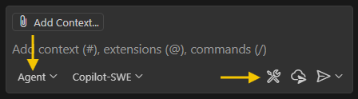
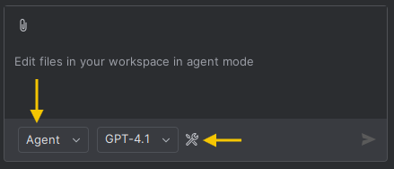

<!--
This readme is used to generate output readme for different package repositories.
Minor changes to the markdown is required for each package repository as such comment annotations are used to mark parts of the readme that will be updated based on the target package type. Use the eng\scripts\Process-PackageReadMe.ps1 to process the readme

e.g. eng\scripts\Process-PackageReadMe.ps1 -InputReadMePath "this readme path" -OutputDirectory "output readme directory" -PackageType "nuget, npm, or vsix"

Here are the allowed comment annotations

remove-section: start and remove-section: end is used to remove various lines of markdown for a specified package type
e.g.
remove-section: start nuget;vsix;npm
various markdown lines
.....
remove-section: end

remove-chunk: start and remove-chunk: end is used to remove part of the text in a line for a specific package type. Should be used only once on a line
e.g.
remove-chunk: start nuget;vsix chunk of text ... remove-chunk: end

insert-chunk is used to insert a chunk of text for a specified package type. Use this only once on a line.
e.g.
insert-chunk nuget;vsix;npm {{Text to be inserted}}

Remember to wrap each annotation in markdown comments
-->

# <!-- remove-chunk: start nuget;vsix --> <!-- remove-chunk: end -->Azure MCP Server<!-- insert-chunk nuget;vsix;npm {{ToolTitle}} -->

The Azure MCP Server implements the [MCP specification](https://modelcontextprotocol.io) to create a seamless connection between AI agents and Azure services. Azure MCP Server can be used alone or with GitHub Copilot Extension for VSCode or InteliJ IDEA.  This project is in Public Preview and implementation may significantly change prior to our General Availability.

<!-- remove-section: start nuget;vsix;npm -->
>[!WARNING]
>**Deprecation Notice: SSE transport mode has been removed in version [0.4.0 (2025-07-15)](https://github.com/microsoft/mcp/blob/main/servers/Azure.Mcp.Server/CHANGELOG.md#040-2025-07-15).**
>
> SSE was deprecated in MCP `2025-03-26` due to [security vulnerabilities and architectural limitations](https://blog.fka.dev/blog/2025-06-06-why-mcp-deprecated-sse-and-go-with-streamable-http/). Users must discontinue use of SSE transport mode and upgrade to version `0.4.0` or newer to maintain compatibility with current MCP clients.
<!-- remove-section: end -->

## Table of Contents
- [Overview](#overview)
- [Getting Started](#getting-started)
  - [Prerequisites](#prerequisites)
  - [Configuration](#configuration)
- [What can you do with the Azure MCP Server?](#what-can-you-do-with-the-azure-mcp-server)
- [Currently Supported Tools](#currently-supported-tools)
- [Data Collection](#data-collection)
- [Troubleshooting](#troubleshooting)
- [Security Note](#security-note)
- [Contributing](#contributing)
- [Code of Conduct](#code-of-conduct)

## Overview

**Azure MCP Server** provides smart, context-aware capabilities to GitHub Copilot to help you work more efficiently with Azure resources. The Azure MCP Server enables AI agents and clients with Azure context across **30+ different Azure services**.

## Getting Started

### Prerequisites
Before you begin, ensure you have:
- An active Azure subscription
- A supported IDE with the GitHub Copilot extension / plugin installed.

    || Visual Studio Code | IntelliJ IDEA |
    |-------|-----|-----|
    |1| Install either the [Stable](https://code.visualstudio.com/download) or [Insiders](https://code.visualstudio.com/insiders) release of VS Code | Install either the [IntelliJ IDEA Ultimate](https://www.jetbrains.com/idea/download) or [IntelliJ IDEA Community](https://www.jetbrains.com/idea/download) edition. |
    |2| Install the [GitHub Copilot](https://marketplace.visualstudio.com/items?itemName=GitHub.copilot) and [GitHub Copilot Chat](https://marketplace.visualstudio.com/items?itemName=GitHub.copilot-chat) extensions | Install the [GitHub Copilot](https://plugins.jetbrains.com/plugin/17718-github-copilot) plugin. |

<!-- remove-section: start npm;vsix -->
- To use Azure MCP server from .NET, you must have [.NET 10 Preview 6 or later](https://dotnet.microsoft.com/download/dotnet/10.0) installed. This version of .NET adds a command, dnx, which is used to download, install, and run the MCP server from [nuget.org](https://www.nuget.org).
To verify your .NET version, run the following command in your terminal: `dotnet --info`
<!-- remove-section: end -->
<!-- remove-section: start nuget;vsix -->
- To use Azure MCP server from node you must have Node.js (LTS) installed and available on your system PATH — this provides both `npm` and `npx`. We recommend Node.js 20 LTS or later. To verify your installation run: `node --version`, `npm --version`, and `npx --version`.
<!-- remove-section: end -->

### Configuration

You can configure the Azure MCP Server by installing the appropriate extension / plugin for your IDE or editing the `mcp.json` file directly.
- Installing the extension / plugin

  |Visual Studio Code | IntelliJ IDEA |
  |-------|-----|
  | Install the [Azure MCP Server Visual Studio Code extension](https://marketplace.visualstudio.com/items?itemName=ms-azuretools.vscode-azure-mcp-server) | Install the [Azure Toolkit for Intellij plugin](https://plugins.jetbrains.com/plugin/8053-azure-toolkit-for-intellij) |

- Edit the `mcp.json` file directly.


    <!-- remove-section: start vsix -->
    <!-- remove-chunk: start nuget;npm --><details><!-- remove-chunk: end -->
    <!-- remove-chunk: start nuget;npm --><summary><b>Find mcp.json file for your IDE</b></summary><!-- remove-chunk: end -->
    <!-- insert-chunk nuget;npm {{#### Find mcp.json file for your IDE}} -->

    ||| Find mcp.json in Visual Studio Code | Find mcp.json in IntelliJ IDEA |
    |-------|-----|-----|-----|
    |1| Open GitHub Copilot in your IDE | View > Chat  | Tools > GitHub Copilot > Open Chat  |
    |2| Switch to Agent Mode then click on the Tools Configuration button  |   |   |
    |2| Click on the button for configuring or adding tools  | Gear icon button if a previous `mcp.json` tool has been configured. Otherwise you can create a new `mcp.json` in your project | + Add More Tools |
    </details>
    <!-- remove-section: end -->

    <!-- remove-section: start vsix;npm -->
    <!-- remove-chunk: start nuget --><details><!-- remove-chunk: end -->
    <!-- remove-chunk: start nuget --><summary><b>Configure Azure MCP Server using .NET Tool</b></summary><!-- remove-chunk: end -->
    <!-- insert-chunk nuget {{#### Configure Azure MCP Server in mcp.json}} -->

    To use the latest version enter the following snippet in your `mcp.json`
    ```json
    "servers": {
      "Azure MCP Server": {
        "command": "dnx",
        "args": [
          "Azure.Mcp",
          "--source",
          "https://api.nuget.org/v3/index.json",
          "--yes",
          "--",
          "azmcp",
          "server",
          "start"
        ],
        "type": "stdio"
      }
    }
    ```

    You can also specific a version using the --version argument, like so:

    ```json
    "servers": {
      "Azure MCP Server": {
        "command": "dnx",
        "args": [
          "Azure.Mcp",
          "--source",
          "https://api.nuget.org/v3/index.json",
          "--version",
          "<version>",
          "--yes",
          "--",
          "azmcp",
          "server",
          "start"
        ],
        "type": "stdio"
      }
    }
    ```
    </details>
    <!-- remove-section: end -->

    <!-- remove-section: start vsix;nuget -->
    <!-- remove-chunk: start npm --><details><!-- remove-chunk: end -->
    <!-- remove-chunk: start npm --><summary><b>Configure Azure MCP Server using node tool</b></summary><!-- remove-chunk: end -->
    <!-- insert-chunk npm {{#### Configure Azure MCP Server in mcp.json}} -->

    To use the latest version enter the following snippet in your mcp.json

    ```json
    "servers": {
      "azure-mcp-server": {
        "command": "npx",
        "args": [
          "-y",
          "@azure/mcp@latest",
          "server",
          "start"
        ]
      }
    }
    ```

    You can also install a targeted version

    ```json
    "servers": {
      "azure-mcp-server": {
        "command": "npx",
        "args": [
          "-y",
          "@azure/mcp@<version>",
          "server",
          "start"
        ]
      }
    }
    ```
    </details>
    <!-- remove-section: end -->

    <!-- remove-chunk: start npm;nuget;vsix --><details><!-- remove-chunk: end -->
    <!-- remove-chunk: start npm;nuget;vsix --><summary><b>Start (or Auto-Start) the MCP Server</b></summary><!-- remove-chunk: end -->
    <!-- insert-chunk npm;nuget;vsix {{#### Start (or Auto-Start) the MCP Server}} -->

    | | Enable Auto-Start | | Manual Start (if autostart is off) |
    | -- | -- | -- | -- |
    | 1| Open Settings in VS Code | 1| Open Command Palette (Ctrl+Shift+P / Cmd+Shift+P). |
    | 2| Search for `chat.mcp.autostart` | 2| Run MCP: List Servers. |
    | 3| Select **newAndOutdated** to automatically start MCP servers without manual refresh. | 3| Select Azure MCP Server ext, then click Start Server. |
    | 4| You can also set this from the refresh icon tooltip in the Chat view, which also shows which servers will auto-start. | 4| Confirm its runing observing the log messages in the output tab. |

    </details>


## <!-- remove-chunk: start nuget;vsix --><a id="what-can-you-do-with-the-azure-mcp-server"></a> ✨<!-- remove-chunk: end --> What can you do with the Azure MCP Server?

The Azure MCP Server supercharges your agents with Azure context. Here are some cool prompts you can try:

### 🔎 Azure AI Search

* "What indexes do I have in my Azure AI Search service 'mysvc'?"
* "Let's search this index for 'my search query'"

### ⚙️ Azure App Configuration

* "List my App Configuration stores"
* "Show my key-value pairs in App Config"

### ⚙️ Azure App Lens

* "Help me diagnose issues with my app"

### 📦 Azure Container Registry (ACR)

* "List all my Azure Container Registries"
* "Show me my container registries in the 'myproject' resource group"
* "List all my Azure Container Registry repositories"

### ☸️ Azure Kubernetes Service (AKS)

* "List my AKS clusters in my subscription"
* "Show me all my Azure Kubernetes Service clusters"
* "List the node pools for my AKS cluster"
* "Get details for the node pool 'np1' of my AKS cluster 'my-aks-cluster' in 'my-resource-group' resource group"

### 📊 Azure Cosmos DB

* "Show me all my Cosmos DB databases"
* "List containers in my Cosmos DB database"

### 🧮 Azure Data Explorer

* "Get Azure Data Explorer databases in cluster 'mycluster'"
* "Sample 10 rows from table 'StormEvents' in Azure Data Explorer database 'db1'"

### 📣 Azure Event Grid

* "List all Event Grid topics in subscription 'my-subscription'"
* "Show me the Event Grid topics in my subscription"
* "List all Event Grid topics in resource group 'my-resourcegroup' in my subscription"

### ⚡ Azure Managed Lustre

* "List the Azure Managed Lustre clusters in resource group 'my-resourcegroup'"
* "How many IP Addresses I need to create a 128 TiB cluster of AMLFS 500?"

### 📊 Azure Monitor

* "Query my Log Analytics workspace"

### 🔧 Azure Resource Management

* "List my resource groups"
* "List my Azure CDN endpoints"
* "Help me build an Azure application using Node.js"

### 🗄️ Azure SQL Database

* "Show me details about my Azure SQL database 'mydb'"
* "List all databases in my Azure SQL server 'myserver'"
* "List all firewall rules for my Azure SQL server 'myserver'"
* "Create a firewall rule for my Azure SQL server 'myserver'"
* "Delete a firewall rule from my Azure SQL server 'myserver'"
* "List all elastic pools in my Azure SQL server 'myserver'"
* "List Active Directory administrators for my Azure SQL server 'myserver'"
* "Create a new Azure SQL server in my resource group"
* "Show me details about my Azure SQL server 'myserver'"
* "Delete my Azure SQL server 'myserver'"

### 💾 Azure Storage

* "List my Azure storage accounts"
* "Get details about my storage account 'mystorageaccount'"
* "Create a new storage account in East US with Data Lake support"
* "Show me the tables in my Storage account"
* "Get details about my Storage container"
* "Upload my file to the blob container"
* "List paths in my Data Lake file system"
* "List files and directories in my File Share"
* "Send a message to my storage queue"


## <!-- remove-chunk: start nuget;vsix --><a id="currently-supported-tools"></a> 🛠️<!-- remove-chunk: end --> Currently Supported Tools

<!-- remove-chunk: start nuget --><details><!-- remove-chunk: end -->
<!-- remove-chunk: start nuget --><summary>The Azure MCP Server provides tools for interacting with the following Azure services</summary><!-- remove-chunk: end -->
<!-- insert-chunk nuget {{The Azure MCP Server provides tools for interacting with the following Azure services}} -->

### 🔎 Azure AI Search (search engine/vector database)

* List Azure AI Search services
* List indexes and look at their schema and configuration
* Query search indexes

### ⚙️ Azure App Configuration

* List App Configuration stores
* Manage key-value pairs
* Handle labeled configurations
* Lock/unlock configuration settings

### 🛡️ Azure Best Practices

* Get secure, production-grade Azure SDK best practices for effective code generation.

### 📦 Azure Container Registry (ACR)

* List Azure Container Registries and repositories in a subscription
* Filter container registries and repositories by resource group
* JSON output formatting
* Cross-platform compatibility

### 📊 Azure Cosmos DB (NoSQL Databases)

* List Cosmos DB accounts
* List and query databases
* Manage containers and items
* Execute SQL queries against containers

### 🧮 Azure Data Explorer

* List Azure Data Explorer clusters
* List databases
* List tables
* Get schema for a table
* Sample rows from a table
* Query using KQL

### 🐬 Azure Database for MySQL - Flexible Server

* List and query databases.
* List and get schema for tables.
* List, get configuration and get parameters for servers.

### 🐘 Azure Database for PostgreSQL - Flexible Server

* List and query databases.
* List and get schema for tables.
* List, get configuration and get/set parameters for servers.

### 🚀 Azure Deploy

* Generate Azure service architecture diagrams from source code
* Create a deploy plan for provisioning and deploying the application
* Get the application service log for a specific azd environment
* Get the bicep or terraform file generation rules for an application
* Get the GitHub pipeline creation guideline for an application

### 📣 Azure Event Grid

* List Event Grid topics in subscription or resource group
* View topic configuration and status information
* Access endpoint and key details for event publishing

### 🧮 Azure Foundry

* List Azure Foundry models
* Deploy foundry models
* List foundry model deployments
* List knowledge indexes

### ☁️ Azure Function App

* List Azure Function Apps
* Get details for a specific Function App

### 🔑 Azure Key Vault

* List, create, and import certificates
* List and create keys
* List and create secrets

### ☸️ Azure Kubernetes Service (AKS)

* List Azure Kubernetes Service clusters

### 📦 Azure Load Testing

* List, create load test resources
* List, create load tests
* Get, list, (create) run and rerun, update load test runs


### 🚀 Azure Managed Grafana

* List Azure Managed Grafana

### ⚡ Azure Managed Lustre

* List Azure Managed Lustre filesystems
* Get the number of IP addresses required for a specific SKU and size of Azure Managed Lustre filesystem
* Get information of Azure Managed Lustre SKUs available in a specific Azure region

### 🏪 Azure Marketplace

* List marketplace products available to a subscription with filtering capabilities
* Get details about Marketplace products

### 📈 Azure Monitor

#### Log Analytics

* List Log Analytics workspaces
* Query logs using KQL
* List available tables

#### Health Models

* Get health of an entity

#### Metrics

* Query Azure Monitor metrics for resources with time series data
* List available metric definitions for resources

### ⚙️ Azure Native ISV Services

* List Monitored Resources in a Datadog Monitor

### 🛡️ Azure Quick Review CLI Extension

* Scan Azure resources for compliance related recommendations

### 📊 Azure Quota

* List available regions
* Check quota usage

### 🔴 Azure Redis Cache

* List Redis Cluster resources
* List databases in Redis Clusters
* List Redis Cache resources
* List access policies for Redis Caches

### 🏗️ Azure Resource Groups

* List resource groups

### 🏥 Azure Resource Health

* Get the availability status for a specific resource
* List availability statuses for all resources in a subscription or resource group
* List service health events in a subscription

### 🎭 Azure Role-Based Access Control (RBAC)

* List role assignments

### 🚌 Azure Service Bus

* Examine properties and runtime information about queues, topics, and subscriptions

### 🗄️ Azure SQL Database

* Show database details and properties
* List the details and properties of all databases
* List SQL server firewall rules
* Create SQL server firewall rules
* Delete SQL server firewall rules

### 🗄️ Azure SQL Elastic Pool

* List elastic pools in SQL servers

### 🗄️ Azure SQL Server

* List Microsoft Entra ID administrators for SQL servers
* Create new SQL servers
* Show details and properties of SQL servers
* Delete SQL servers

### 💾 Azure Storage

* List and create Storage accounts
* Get detailed information about specific Storage accounts
* Manage blob containers and blobs
* Upload files to blobs
* List and query Storage tables
* List paths in Data Lake file systems
* Get container properties and metadata
* List files and directories in File Shares

### 📋 Azure Subscription

* List Azure subscriptions

### 🏗️ Azure Terraform Best Practices

* Get secure, production-grade Azure Terraform best practices for effective code generation and command execution

### 🖥️ Azure Virtual Desktop

* List Azure Virtual Desktop host pools
* List session hosts in host pools
* List user sessions on a session host

### 📊 Azure Workbooks

* List workbooks in resource groups
* Create new workbooks with custom visualizations
* Update existing workbook configurations
* Get workbook details and metadata
* Delete workbooks when no longer needed

### 🏗️ Bicep

* Get the Bicep schema for specific Azure resource types

### 🏗️ Cloud Architect

* Design Azure cloud architectures through guided questions

Agents and models can discover and learn best practices and usage guidelines for the `azd` MCP tool. For more information, see [AZD Best Practices](https://github.com/microsoft/mcp/tree/main/tools/Azure.Mcp.Tools.Extension/src/Resources/azd-best-practices.txt).

<!-- remove-chunk: start nuget --></details><!-- remove-chunk: end -->

For detailed command documentation and examples, see [Azure MCP Commands](https://github.com/microsoft/mcp/blob/main/docs/azmcp-commands.md).

## <!-- remove-chunk: start nuget --><a id="upgrading"></a> 🔄️<!-- remove-chunk: end --> Upgrading

<!-- remove-chunk: start nuget --><details><!-- remove-chunk: end -->
<!-- remove-chunk: start nuget --><summary>How to stay current with releases of Azure MCP Server</summary><!-- remove-chunk: end -->
<!-- insert-chunk nuget {{How to stay current with releases of Azure MCP Serve}} -->

<!-- remove-section: start vsix;nuget -->
#### NPX

If you use the default package spec of `@azure/mcp@latest`, npx will look for a new version on each server start. If you use just `@azure/mcp`, npx will continue to use its cached version until its cache is cleared.

#### NPM

If you globally install the cli via `npm install -g @azure/mcp` it will use the installed version until you manually update it with `npm update -g @azure/mcp`.
<!-- remove-section: end -->
<!-- remove-section: start vsix;nuget;npm -->
#### Docker

There is no version update built into the docker image.  To update, just pull the latest from the repo and repeat the [docker installation instructions](#docker-install).
<!-- remove-section: end -->

<!-- remove-section: start vsix -->
#### VS Code

Installation in VS Code should be in one of the previous forms and the update instructions are the same. If you installed the mcp server with the `npx` command and  `-y @azure/mcp@latest` args, npx will check for package updates each time VS Code starts the server. Using a docker container in VS Code has the same no-update limitation described above.
<!-- remove-section: end -->

#### IntelliJ

If the Azure MCP server is configured by Azure Toolkit for IntelliJ plugin, the version is automatically updated to the latest version when the IntelliJ project starts. If the Azure MCP server is manually configured with `npx` command and `-y @azure/mcp@latest` args, npx will check for package updates each time IntelliJ starts the server. Using a docker container in IntelliJ has the same no-update limitation described above.

<!-- remove-chunk: start nuget --></details><!-- remove-chunk: end -->

<!-- remove-section: start npm;vsix;nuget -->
## <!-- remove-chunk: start nuget --><a id="advanced-install-scenarios-optional"></a> ⚙️<!-- remove-chunk: end --> Advanced Install Scenarios (Optional)

<!-- remove-chunk: start nuget --><details><!-- remove-chunk: end -->
<!-- remove-chunk: start nuget --><summary>Docker containers, custom MCP clients, and manual install options</summary><!-- remove-chunk: end -->
<!-- insert-chunk nuget {{Docker containers, custom MCP clients, and manual install options}} -->

### 🐋 Docker Install Steps (Optional)

Microsoft publishes an official Azure MCP Server Docker container on the [Microsoft Artifact Registry](https://mcr.microsoft.com/artifact/mar/azure-sdk/azure-mcp).

For a step-by-step Docker installation, follow these instructions:

1. Create an `.env` file with environment variables that [match one of the `EnvironmentCredential`](https://learn.microsoft.com/dotnet/api/azure.identity.environmentcredential) sets.  For example, a `.env` file using a service principal could look like:

    ```bash
    AZURE_TENANT_ID={YOUR_AZURE_TENANT_ID}
    AZURE_CLIENT_ID={YOUR_AZURE_CLIENT_ID}
    AZURE_CLIENT_SECRET={YOUR_AZURE_CLIENT_SECRET}
    ```

2. Add `.vscode/mcp.json` or update existing MCP configuration. Replace `/full/path/to/.env` with a path to your `.env` file.

    ```json
    {
      "servers": {
        "Azure MCP Server": {
          "command": "docker",
          "args": [
            "run",
            "-i",
            "--rm",
            "--env-file",
            "/full/path/to/.env"
            "mcr.microsoft.com/azure-sdk/azure-mcp:latest",
          ]
        }
      }
    }
    ```

Optionally, use `--env` or `--volume` to pass authentication values.

### 🤖 Custom MCP Client Install Steps (Optional)

You can easily configure your MCP client to use the Azure MCP Server. Have your client run the following command and access it via standard IO.

```bash
npx -y @azure/mcp@latest server start
```

### 🔧 Manual Install Steps (Optional)

For a step-by-step installation, follow these instructions:

1. Add `.vscode/mcp.json`:

    ```json
    {
      "servers": {
        "Azure MCP Server": {
          "command": "npx",
          "args": [
            "-y",
            "@azure/mcp@latest",
            "server",
            "start"
          ]
        }
      }
    }
    ```

    You can optionally set the `--namespace <namespace>` flag to install tools for the specified Azure product or service.

1. Add `.vscode/mcp.json`:

    ```json
    {
      "servers": {
        "Azure Best Practices": {
          "command": "npx",
          "args": [
            "-y",
            "@azure/mcp@latest",
            "server",
            "start",
            "--namespace",
            "bestpractices" // Any of the available MCP servers can be referenced here.
          ]
        }
      }
    }
    ```

More end-to-end MCP client/agent guides are coming soon!
<!-- remove-chunk: start nuget --></details><!-- remove-chunk: end -->
<!-- remove-section: end -->


## <!-- remove-chunk: start nuget --><a id="data-collection"></a><!-- remove-chunk: end --> Data Collection

The software may collect information about you and your use of the software and send it to Microsoft. Microsoft may use this information to provide services and improve our products and services. You may turn off the telemetry as described in the repository. There are also some features in the software that may enable you and Microsoft to collect data from users of your applications. If you use these features, you must comply with applicable law, including providing appropriate notices to users of your applications together with a copy of Microsoft's [privacy statement](https://www.microsoft.com/privacy/privacystatement). You can learn more about data collection and use in the help documentation and our privacy statement. Your use of the software operates as your consent to these practices.

### Telemetry Configuration

Telemetry collection is on by default.

To opt out, set the environment variable `AZURE_MCP_COLLECT_TELEMETRY` to `false` in your environment.


## <!-- remove-chunk: start nuget --><a id="troubleshooting"></a> 📝<!-- remove-chunk: end --> Troubleshooting

See [Troubleshooting guide](https://github.com/microsoft/mcp/blob/main/servers/Azure.Mcp.Server/TROUBLESHOOTING.md) for help with common issues and logging.

### 🔑 Authentication

<!-- remove-chunk: start nuget --><details><!-- remove-chunk: end -->
<!-- remove-chunk: start nuget --><summary>Authentication options including DefaultAzureCredential flow, RBAC permissions, troubleshooting, and production credentials</summary><!-- remove-chunk: end -->
<!-- insert-chunk nuget {{Authentication options including DefaultAzureCredential flow, RBAC permissions, troubleshooting, and production credentials}} -->

The Azure MCP Server uses the Azure Identity library for .NET to authenticate to Microsoft Entra ID. For detailed information, see [Authentication Fundamentals](https://github.com/microsoft/mcp/blob/main/docs/Authentication.md#authentication-fundamentals).

If you're running into any issues with authentication, visit our [troubleshooting guide](https://github.com/microsoft/mcp/blob/main/servers/Azure.Mcp.Server/TROUBLESHOOTING.md#authentication).

For enterprise authentication scenarios, including network restrictions, security policies, and protected resources, see [Authentication Scenarios in Enterprise Environments](https://github.com/microsoft/mcp/blob/main/docs/Authentication.md#authentication-scenarios-in-enterprise-environments).
<!-- remove-chunk: start nuget --></details><!-- remove-chunk: end -->

## <!-- remove-chunk: start nuget --><a id="security-note"></a> 🛡️<!-- remove-chunk: end --> Security Note

Your credentials are always handled securely through the official [Azure Identity SDK](https://github.com/Azure/azure-sdk-for-net/blob/main/sdk/identity/Azure.Identity/README.md) - **we never store or manage tokens directly**.

MCP as a phenomenon is very novel and cutting-edge. As with all new technology standards, consider doing a security review to ensure any systems that integrate with MCP servers follow all regulations and standards your system is expected to adhere to. This includes not only the Azure MCP Server, but any MCP client/agent that you choose to implement down to the model provider.


## <!-- remove-chunk: start nuget --><a id="contributing"></a> 👥<!-- remove-chunk: end --> Contributing

We welcome contributions to the Azure MCP Server! Whether you're fixing bugs, adding new features, or improving documentation, your contributions are welcome.

Please read our [Contributing Guide](https://github.com/microsoft/mcp/blob/main/CONTRIBUTING.md) for guidelines on:

* 🛠️ Setting up your development environment
* ✨ Adding new commands
* 📝 Code style and testing requirements
* 🔄 Making pull requests


## <!-- remove-chunk: start nuget --><a id="code-of-conduct"></a> 🤝<!-- remove-chunk: end --> Code of Conduct

This project has adopted the
[Microsoft Open Source Code of Conduct](https://opensource.microsoft.com/codeofconduct/).
For more information, see the
[Code of Conduct FAQ](https://opensource.microsoft.com/codeofconduct/faq/)
or contact [open@microsoft.com](mailto:open@microsoft.com)
with any additional questions or comments.

