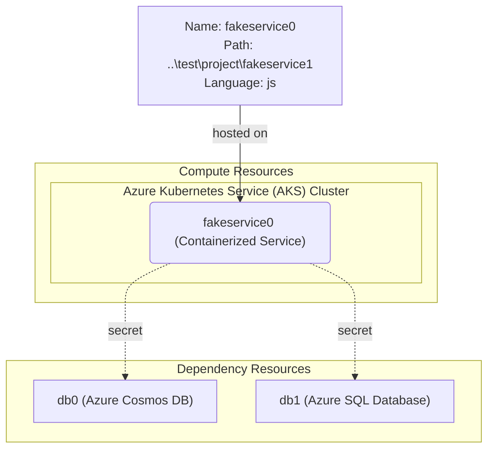

```mermaid
graph TD
%% Services
svcazurekubernetesservice_fakeservice0["`Name: fakeservice0
Path: ..\test\project\fakeservice1
Language: js`"]
subgraph "Compute Resources"
%% Resources
subgraph akscluster["Azure Kubernetes Service (AKS) Cluster"]
azurekubernetesservice_fakeservice0("`fakeservice0 (Containerized Service)`")
end
akscluster:::cluster
end
subgraph "Dependency Resources"
%% Dependency Resources
azurecosmosdb_db0["`db0 (Azure Cosmos DB)`"]
azuresqldatabase_db1["`db1 (Azure SQL Database)`"]
end
%% Relationships
svcazurekubernetesservice_fakeservice0 --> |"hosted on"| azurekubernetesservice_fakeservice0
azurekubernetesservice_fakeservice0 -.-> |"secret"| azurecosmosdb_db0
azurekubernetesservice_fakeservice0 -.-> |"secret"| azuresqldatabase_db1
```
