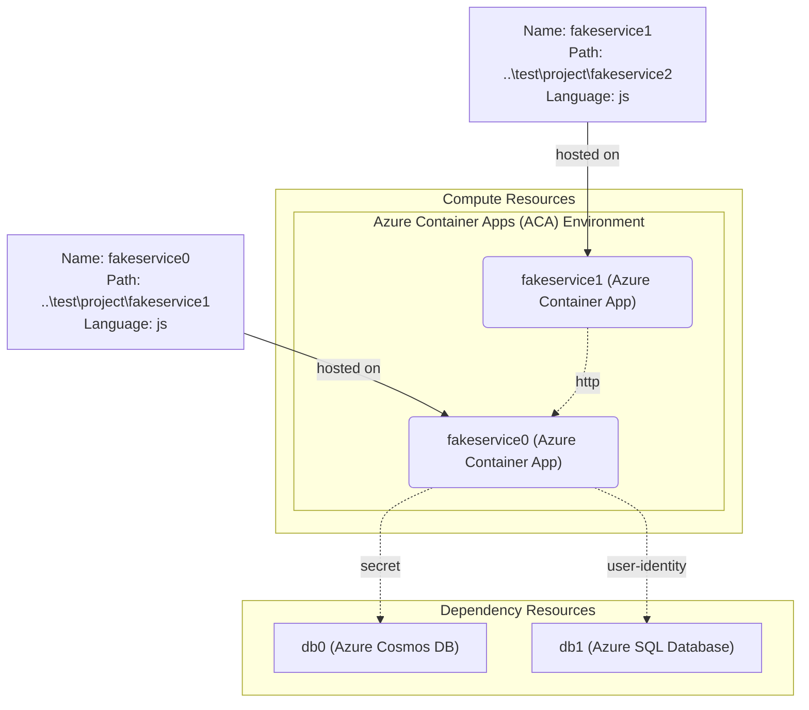

```mermaid
graph TD
%% Services
svcazurecontainerapps_fakeservice0["`Name: fakeservice0
Path: ..\test\project\fakeservice1
Language: js`"]
svcazurecontainerapps_fakeservice1["`Name: fakeservice1
Path: ..\test\project\fakeservice2
Language: js`"]
subgraph "Compute Resources"
%% Resources
subgraph containerappenv["Azure Container Apps (ACA) Environment"]
azurecontainerapps_fakeservice0("`fakeservice0 (Azure Container App)`")
azurecontainerapps_fakeservice1("`fakeservice1 (Azure Container App)`")
end
containerappenv:::cluster
end
subgraph "Dependency Resources"
%% Dependency Resources
azurecosmosdb_db0["`db0 (Azure Cosmos DB)`"]
azuresqldatabase_db1["`db1 (Azure SQL Database)`"]
end
%% Relationships
svcazurecontainerapps_fakeservice0 --> |"hosted on"| azurecontainerapps_fakeservice0
azurecontainerapps_fakeservice0 -.-> |"secret"| azurecosmosdb_db0
azurecontainerapps_fakeservice0 -.-> |"user-identity"| azuresqldatabase_db1
svcazurecontainerapps_fakeservice1 --> |"hosted on"| azurecontainerapps_fakeservice1
azurecontainerapps_fakeservice1 -.-> |"http"| azurecontainerapps_fakeservice0
```
